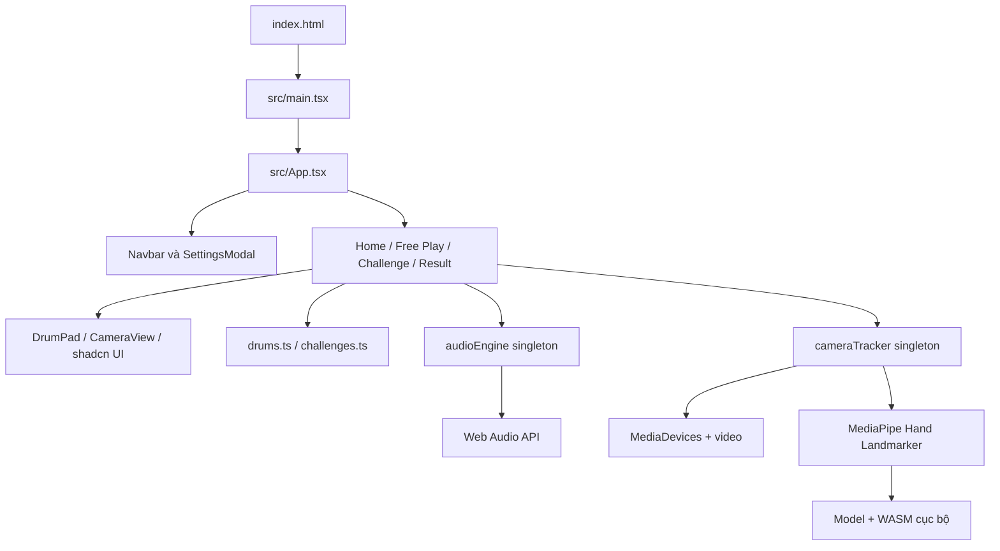
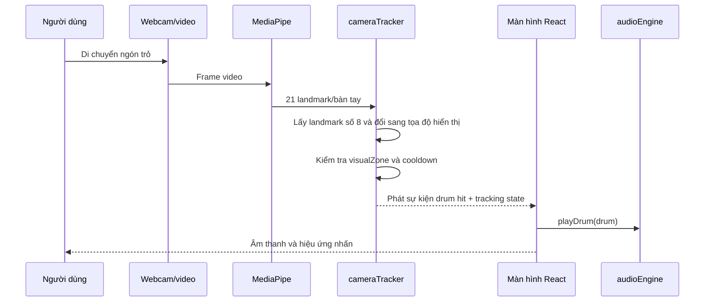

# BÁO CÁO CHỨC NĂNG VÀ VIỆC ỨNG DỤNG CÔNG NGHỆ FRONTEND

## 1. Thông tin chung

| Nội dung | Thông tin |
| --- | --- |
| Tên sản phẩm | Virtual Drum |
| Loại sản phẩm | Ứng dụng web chơi trống ảo và luyện phản xạ nhịp điệu |
| Nền tảng | Trình duyệt web trên máy tính hoặc thiết bị di động |
| Kiến trúc triển khai | Single Page Application (SPA), xử lý hoàn toàn ở phía client |
| Công nghệ chính | React 19, TypeScript, Vite 8, Tailwind CSS 4, shadcn/ui, Base UI, MediaPipe Tasks Vision, Web Audio API |
| Phạm vi báo cáo | Mã nguồn hiện có trong thư mục `src`, tài nguyên `public`, cấu hình build và dependencies |
| Ngày đánh giá | 28/09/2026 |

## 2. Tóm tắt dự án

Virtual Drum cho phép người dùng tạo âm thanh trống trực tiếp trong trình duyệt bằng ba phương thức đầu vào:

1. Di chuyển đầu ngón trỏ vào vùng trống trên hình ảnh webcam.
2. Nhấn phím tắt trên bàn phím.
3. Nhấn chuột hoặc chạm trực tiếp lên các drum pad.

Ứng dụng có hai chế độ chính là **Free Play** và **Rhythm Challenge**. Free Play phục vụ chơi tự do, theo dõi combo và tổng số lần đánh. Rhythm Challenge đưa ra chuỗi trống cần đánh theo thứ tự, tính điểm, combo, độ chính xác, xếp hạng và hiển thị kết quả cuối màn.

Điểm nổi bật về kỹ thuật là nhận diện bàn tay và tổng hợp âm thanh đều được thực hiện tại máy người dùng. Model MediaPipe và WebAssembly được đóng gói trong `public/mediapipe`; hình ảnh camera không cần gửi đến máy chủ. Dự án hiện không có backend, cơ sở dữ liệu, tài khoản người dùng hay API AI từ xa.

## 3. Mục tiêu và đối tượng sử dụng

### 3.1. Mục tiêu

- Mô phỏng một bộ trống năm thành phần ngay trên trình duyệt.
- Tạo cách tương tác tự nhiên bằng cử chỉ tay qua webcam.
- Cung cấp phản hồi âm thanh và hình ảnh có độ trễ thấp.
- Hỗ trợ người mới làm quen với vị trí trống và chuỗi nhịp cơ bản.
- Hoạt động mà không cần cài phần mềm chuyên dụng hoặc tải file âm thanh ngoài.

### 3.2. Đối tượng sử dụng

- Người muốn trải nghiệm nhạc cụ tương tác trên web.
- Người mới học trống cần luyện phối hợp tay và ghi nhớ chuỗi trống.
- Người dùng trình diễn hoặc thử nghiệm giao diện điều khiển bằng computer vision.
- Sinh viên nghiên cứu cách kết hợp React, MediaPipe và Web Audio API.

## 4. Báo cáo chi tiết các chức năng

### 4.1. Trang chủ

Trang chủ đóng vai trò giới thiệu và điều hướng. Các chức năng đã triển khai gồm:

- Hiển thị tên sản phẩm, mô tả ngắn và đặc điểm điều khiển bằng webcam.
- Điều hướng đến **Free Play** hoặc **Rhythm Challenge**.
- Cung cấp bộ trống xem thử gồm Hi-Hat, Tom, Crash, Snare và Kick.
- Cho phép nhấn trực tiếp từng drum pad để nghe thử âm thanh.
- Trình bày quy trình sử dụng camera theo ba bước: bật camera, di chuyển tay và chơi trống.

Phần xem thử trên trang chủ chỉ xử lý thao tác nhấn/chạm. Dòng hướng dẫn có hiển thị các phím `H`, `T`, `C`, `S`, `K`, nhưng listener bàn phím hiện chỉ được cài ở màn hình Free Play và Rhythm Challenge.

### 4.2. Thanh điều hướng chung

Thanh điều hướng được giữ cố định ở đầu trang và cung cấp:

- Liên kết đến Home, Free Play và Rhythm Challenge.
- Trạng thái camera thực tế: `Cam Active` hoặc `Cam Idle`.
- Điều chỉnh âm lượng nhanh và tắt/mở âm lượng ở màn hình lớn.
- Nút mở hộp thoại cài đặt.
- Trạng thái active khác màu theo màn hình hiện tại.

Ứng dụng không sử dụng React Router. Việc chuyển màn hình được điều khiển bằng biến state `currentScreen` trong `App.tsx`; vì vậy URL không thay đổi và chưa hỗ trợ deep link hoặc nút Back/Forward của trình duyệt theo từng màn hình.

### 4.3. Bộ trống và phương thức điều khiển

Hệ thống định nghĩa năm loại trống dùng chung cho toàn ứng dụng:

| Trống | Phím | Đặc điểm âm thanh | Màu nhận diện |
| --- | --- | --- | --- |
| Hi-Hat | `H` | Âm kim loại ngắn, sắc | Amber |
| Tom | `T` | Âm trầm cộng hưởng | Cyan |
| Crash | `C` | Âm chũm chọe dài | Purple |
| Snare | `S` | Thân âm kết hợp nhiễu dây snare | Emerald |
| Kick | `K` hoặc `Space` | Âm bass có transient đầu | Rose |

Mỗi trống có tên, mô tả, màu, màu phát sáng và một `visualZone` riêng. `visualZone` vừa là vị trí hiển thị trên camera, vừa là vùng va chạm dùng để phát hiện đầu ngón tay. Cách dùng chung một nguồn cấu hình giúp vùng người dùng nhìn thấy và vùng hệ thống nhận diện không bị lệch nhau.

### 4.4. Chế độ Free Play

Free Play là chế độ chơi tự do, không yêu cầu người dùng đánh theo một bản nhạc cố định. Các chức năng gồm:

- Bật hoặc dừng webcam ngay trong khu vực chơi.
- Hiển thị video dạng gương, vùng của năm trống và chỉ báo vị trí ngón trỏ.
- Đánh trống bằng webcam, bàn phím, chuột hoặc cảm ứng.
- Phát âm thanh tương ứng ngay sau khi nhận đầu vào.
- Tạo hiệu ứng nhấn/phát sáng trong 180 ms để phản hồi thao tác.
- Hiển thị loại trống vừa đánh.
- Đếm tổng số lần đánh.
- Tăng combo sau mỗi lần đánh và ghi nhận max combo.
- Tự đưa combo về 0 nếu người dùng không đánh trong 2,5 giây.
- Điều chỉnh âm lượng và mở cài đặt ngay trong màn hình chơi.

Combo ở chế độ này đo tính liên tục của thao tác, không đánh giá đúng/sai hoặc timing theo BPM.

### 4.5. Chọn Rhythm Challenge

Màn hình chọn thử thách cung cấp bốn bài:

| Bài | Độ khó | BPM | Số nốt hướng dẫn | Mẫu chính |
| --- | --- | ---: | ---: | --- |
| Beginner Beat | Easy | 75 | 24 | Kick và Snare |
| Basic Rock | Medium | 96 | 56 | Kick, Snare và Hi-Hat |
| Funky Groove | Medium | 112 | 64 | Thêm Tom và đảo phách |
| Fast Beat | Hard | 132 | 80 | Đủ năm loại trống |

Người dùng có thể:

- Chọn card bằng chuột, cảm ứng hoặc bàn phím `Enter`/`Space`.
- Xem độ khó, BPM, tác giả, mô tả và số nốt.
- Nghe thử 10 nốt đầu theo thời gian `timeMs` đã khai báo.
- Dừng bản nghe thử hoặc bắt đầu thử thách.

Âm thanh nghe thử được lập lịch bằng `setTimeout`; thời gian giữa các nốt được sinh từ BPM trong dữ liệu challenge.

### 4.6. Chế độ Rhythm Challenge

Luồng chơi hiện tại là **guided sequence** — luyện chuỗi trống theo từng bước:

1. Màn hình đếm ngược `3 - 2 - 1 - GO` và phát tiếng báo.
2. Ứng dụng tô sáng trống cần đánh tiếp theo.
3. Người dùng đánh bằng camera, bàn phím hoặc nhấn/chạm.
4. Nếu đánh đúng, chỉ số nốt tăng và hệ thống chuyển sang trống tiếp theo.
5. Nếu đánh sai, combo về 0, số lỗi tăng và nốt hiện tại vẫn được giữ để người dùng thử lại.
6. Khi hoàn thành toàn bộ chuỗi, ứng dụng tính kết quả và chuyển đến màn hình tổng kết.

Các chỉ số hiển thị trong khi chơi gồm score, combo, accuracy tạm thời, tiến độ, số câu đúng, số lần đánh sai và max combo.

#### Cách tính điểm hiện tại

- Mỗi câu đúng cơ bản nhận 300 điểm.
- Combo từ nốt thứ 12 đến nốt thứ 21 áp dụng hệ số x2.
- Từ nốt thứ 22 trở đi áp dụng hệ số x3.
- Đánh sai không trừ điểm nhưng phá combo và làm giảm accuracy.
- Mọi câu đúng được tính là `perfect`; mức `good` chưa được sử dụng trong gameplay hiện tại.

Điểm tối đa tương ứng của bốn bài là 12.000, 40.800, 48.000 và 62.400 điểm nếu không đánh sai.

#### Cách tính accuracy và xếp hạng

Accuracy cuối màn được tính theo công thức:

```text
accuracy = số lần đánh đúng / (số lần đánh đúng + số lần đánh sai) × 100%
```

| Accuracy | Hạng | Số sao |
| ---: | --- | ---: |
| Từ 95% | S | 3 |
| Từ 85% đến dưới 95% | A | 3 |
| Từ 70% đến dưới 85% | B | 2 |
| Từ 50% đến dưới 70% | C | 1 |
| Dưới 50% | D | 0 |

Mặc dù dữ liệu challenge có `BPM`, `durationSeconds` và `timeMs`, màn hình chơi hiện chưa dùng chúng để giới hạn thời gian hoặc đánh giá sớm/muộn. BPM đang có tác dụng ở phần thông tin và nghe thử; challenge thực tế chờ đến khi người dùng đánh đúng nốt hiện tại. Component `BeatTimeline` đã được viết nhưng chưa được gắn vào màn hình gameplay.

### 4.7. Màn hình kết quả

Sau khi hoàn thành challenge, màn hình kết quả hiển thị:

- Tên bài và BPM.
- Tổng điểm và hạng S/A/B/C/D.
- Đánh giá từ 0 đến 3 sao.
- Accuracy, max combo, số perfect và số miss.
- Nội dung nhận xét tùy theo mức accuracy.
- Hiệu ứng confetti khi accuracy từ 65% trở lên.
- Các lựa chọn chơi lại, chọn bài khác hoặc về trang chủ.

Thư viện `canvas-confetti` được gọi trong `useEffect` và có `try/catch`, do đó việc không hỗ trợ hiệu ứng không làm gián đoạn màn hình kết quả.

### 4.8. Cài đặt

Hộp thoại cài đặt hiện cung cấp giao diện cho:

- Chọn camera từ danh sách `videoinput` của thiết bị.
- Điều chỉnh master volume từ 0 đến 100%, bước nhảy 5%.
- Bật/tắt âm thanh trống và SFX.
- Bật/tắt tùy chọn hiệu ứng hình ảnh.
- Bật/tắt lật gương video.
- Hiển thị một công tắc trạng thái hand tracking.

Cần lưu ý công tắc hand tracking trong hộp thoại mới chỉ cập nhật `settings.cameraEnabled`, chưa trực tiếp gọi `cameraTracker.start()` hoặc `stop()`. Camera hiện được bật/tắt đúng bằng nút trong `CameraView`. Tương tự, `visualEffectsEnabled` đã có trong state nhưng chưa được dùng để điều kiện hóa hiệu ứng; `showHandIndicators` được sử dụng khi render camera nhưng chưa có control trong hộp thoại.

## 5. Kiến trúc frontend

### 5.1. Sơ đồ thành phần



`App.tsx` là trung tâm quản lý màn hình, challenge đang chọn, kết quả và cài đặt toàn cục. Các màn hình nhận dữ liệu và callback qua props. Hai service `audioEngine` và `cameraTracker` được xuất dưới dạng singleton để giữ tài nguyên trình duyệt và trạng thái xuyên suốt các lần chuyển màn hình.

### 5.2. Luồng nhận diện cử chỉ



### 5.3. Quản lý state và vòng đời

- React `useState` quản lý trạng thái giao diện và số liệu chơi.
- React `useEffect` đồng bộ âm lượng, mirror camera, listener bàn phím và subscription.
- React `useRef` giữ bộ đếm, thống kê, timer và dữ liệu cần đọc ngay trong callback bất đồng bộ mà không chờ render.
- Camera service dùng mô hình publish/subscribe qua `Set` callback cho trạng thái và drum hit.
- Các listener quan trọng được hủy khi component unmount; media tracks được dừng trong `cameraTracker.stop()`.

## 6. Việc ứng dụng các công nghệ frontend

| Công nghệ | Vị trí áp dụng | Vai trò và giá trị |
| --- | --- | --- |
| HTML5 | `index.html`, thẻ `video`, button, heading | Tạo khung SPA, metadata SEO cơ bản và phần tử phát camera |
| React 19 | Toàn bộ `src/components` và `src/screens` | Chia giao diện thành component, quản lý state, props và lifecycle |
| TypeScript | Toàn bộ mã nguồn `.ts/.tsx` | Định nghĩa kiểu `DrumType`, challenge, kết quả, settings và hợp đồng props; giảm lỗi sai dữ liệu |
| Vite 8 | `vite.config.ts`, scripts npm | Development server, HMR, xử lý module ES và tối ưu production build |
| Tailwind CSS 4 | Class trong JSX, `src/index.css` | Responsive layout, dark theme, màu sắc, animation, gradient và utility styling |
| shadcn/ui | `src/components/ui` | Cung cấp lớp component thống nhất như Button, Card, Dialog, Slider, Switch, Select, Progress |
| Base UI | Primitive bên dưới shadcn/ui | Hỗ trợ hành vi và accessibility cho dialog, slider, switch, select và button |
| MediaPipe Tasks Vision | `cameraTracker.ts` | Nhận diện tối đa hai bàn tay và landmark đầu ngón trỏ theo thời gian thực |
| WebAssembly | `public/mediapipe/wasm` | Chạy pipeline computer vision hiệu năng cao ngay trong trình duyệt |
| MediaDevices API | `getUserMedia`, `enumerateDevices` | Xin quyền webcam, chọn camera và nhận luồng video |
| Web Audio API | `audio.ts` | Tổng hợp âm trống bằng oscillator, noise buffer, filter, gain và envelope |
| requestVideoFrameCallback | `cameraTracker.ts` | Chạy inference theo frame video thực, giảm polling/render thừa; fallback về `requestAnimationFrame` |
| Canvas Confetti | `ResultScreen.tsx` | Tạo hiệu ứng chúc mừng ở màn hình kết quả |
| Lucide React | Các màn hình và component | Bộ icon vector đồng nhất, nhẹ và dễ đổi kích thước/màu |
| Geist Variable Font | `src/index.css` | Typography nhất quán và có file font tiếng Việt trong production build |

### 6.1. React và thiết kế component

Giao diện được chia theo hai cấp:

- **Screen component:** Home, Free Play, Challenge Select, Rhythm Game và Result.
- **Reusable component:** Navbar, SettingsModal, DrumPad, CameraView, BeatTimeline và các UI primitive.

Thiết kế này giúp tách nghiệp vụ từng màn hình, tái sử dụng drum pad và giữ cấu hình trống tại một nguồn duy nhất. Controlled props như `isHit`, `energyPercent`, `promptedDrum` làm cho component hiển thị theo state bên ngoài và dễ mở rộng.

### 6.2. TypeScript và mô hình dữ liệu

Các union type giới hạn giá trị hợp lệ, ví dụ `DrumType` chỉ có năm loại trống, `ScreenType` chỉ có năm màn hình và `HitRating` chỉ có `perfect`, `good`, `miss`. Interface mô tả rõ cấu trúc challenge, nốt nhạc, kết quả, cài đặt và vùng nhận diện. Nhờ đó TypeScript có thể kiểm tra đầy đủ các record theo từng loại trống ở bước `tsc --noEmit`.

### 6.3. MediaPipe và xử lý camera

Pipeline camera có các đặc điểm kỹ thuật sau:

- Model `hand_landmarker.task` và runtime WASM được phục vụ từ cùng website, không phụ thuộc CDN.
- Cấu hình tối đa hai bàn tay; confidence detection, presence và tracking đều là 0,5.
- Ưu tiên GPU delegate và tự fallback sang CPU nếu GPU không khả dụng.
- Camera đặt độ phân giải lý tưởng 480×360, tối đa 640×480 và tối đa 60 FPS để cân bằng chất lượng với chi phí inference.
- Chỉ sử dụng landmark số 8, tức đầu ngón trỏ.
- Tọa độ landmark được hiệu chỉnh theo phần video bị crop bởi CSS `object-cover` và theo trạng thái mirror.
- Khi ngón tay đi vào một vùng trống mới, service phát sự kiện hit. Người dùng phải rời vùng rồi vào lại để đánh cùng trống lần tiếp theo.
- Cooldown tối thiểu 140 ms hạn chế double-trigger; grace period 180 ms hạn chế việc mất landmark thoáng qua gây kích hoạt lại ngoài ý muốn.
- Các lỗi quyền camera, không tìm thấy camera hoặc camera đang bận được chuyển thành thông báo thân thiện.

### 6.4. Web Audio API

Ứng dụng không tải các file `.mp3`/`.wav`. Mỗi tiếng trống được tổng hợp bằng audio graph:

- **Kick:** oscillator sine hạ tần số từ 150 Hz xuống 45 Hz, cộng một transient triangle ngắn.
- **Snare:** thân âm triangle kết hợp white noise qua high-pass filter.
- **Hi-Hat:** white noise ngắn qua band-pass khoảng 9.500 Hz.
- **Tom:** oscillator sine hạ từ 140 Hz xuống 75 Hz.
- **Crash:** white noise dài 1,2 giây qua high-pass khoảng 4.500 Hz.

Tất cả node đi qua `masterGain`, cho phép thay đổi âm lượng và mute toàn cục. `AudioContext` chỉ được khởi tạo khi có thao tác phát đầu tiên, phù hợp với chính sách autoplay của trình duyệt.

Ưu điểm là ứng dụng nhẹ về tài nguyên âm thanh, không cần mạng và có thể thay đổi âm sắc bằng code. Hạn chế là độ chân thực phụ thuộc thuật toán tổng hợp và chưa đạt chất lượng của sample trống phòng thu.

### 6.5. Tailwind CSS, responsive và design system

- Mobile-first với các breakpoint `sm`, `md`, `lg`, `xl`.
- Free Play và Rhythm Game chuyển từ một cột trên màn hình nhỏ sang lưới 12 cột trên desktop.
- Sử dụng dark theme, gradient rose/amber, màu riêng cho từng trống và glow để tạo nhận diện nhanh.
- `aspect-ratio`, `max-height` và `object-cover` giữ vùng camera ổn định.
- shadcn/ui và Base UI chuẩn hóa các thành phần tương tác thay vì tự viết toàn bộ hành vi dialog/slider/select.
- Các nút chính có trạng thái hover/active/disabled; card chọn challenge hỗ trợ focus và bàn phím.

### 6.6. Tính riêng tư và an toàn phía client

- Video chỉ được gắn vào phần tử `video` và đưa trực tiếp cho MediaPipe tại trình duyệt.
- Không có đoạn mã upload frame, ghi hình, lưu hình hoặc gọi dịch vụ nhận diện bên ngoài.
- `audio: false` trong constraints nên ứng dụng không yêu cầu microphone.
- MediaStream tracks được dừng khi người dùng tắt camera.
- Khi triển khai thật, camera chỉ hoạt động trong secure context: HTTPS hoặc localhost.

## 7. Cấu trúc thư mục chính

```text
src/
├── components/           Component dùng chung
│   └── ui/               Primitive giao diện shadcn/ui + Base UI
├── data/                 Cấu hình trống và dữ liệu challenge
├── screens/              Năm màn hình nghiệp vụ
├── services/
│   ├── audio.ts          Engine tổng hợp âm thanh
│   └── cameraTracker.ts  Webcam và MediaPipe hand tracking
├── App.tsx               State, settings và điều hướng cấp ứng dụng
├── types.ts              Kiểu dữ liệu dùng chung
└── main.tsx              Điểm khởi tạo React

public/mediapipe/
├── models/               Model Hand Landmarker
└── wasm/                 MediaPipe WebAssembly runtime
```

## 8. Khả năng truy cập và trải nghiệm người dùng

Các điểm đã làm tốt:

- Nhiều nút có `aria-label`, `title` hoặc nội dung chữ rõ ràng.
- Dialog, select, switch, slider sử dụng primitive hỗ trợ accessibility.
- Challenge card có `role="button"`, `tabIndex` và xử lý `Enter`/`Space`.
- Không bắt buộc webcam; người dùng vẫn chơi được bằng bàn phím hoặc pointer.
- Màu sắc đi kèm tên trống và ký tự, không phải là dấu hiệu duy nhất.
- Có trạng thái loading, lỗi camera, feedback đúng/sai và tiến độ.

Các điểm cần cải thiện:

- Bổ sung cơ chế giảm chuyển động theo `prefers-reduced-motion` cho glow, bounce và confetti.
- Kiểm tra độ tương phản của chữ rất nhỏ trên nền tối và tăng kích thước ở mobile.
- Bổ sung live region để screen reader thông báo trống cần đánh, combo và kết quả hit.
- Hoàn thiện thao tác bàn phím ở phần drum preview trang chủ.
- Thêm tùy chọn tắt chỉ báo tay vào Settings và focus style nhất quán cho drum pad.

## 9. Kết quả kiểm tra kỹ thuật

Tại thời điểm lập báo cáo:

| Kiểm tra | Kết quả |
| --- | --- |
| `npm.cmd run lint` (`tsc --noEmit`) | Đạt, không có lỗi TypeScript |
| `npm.cmd run build` | Đạt, Vite build thành công 1.954 module |
| CSS production | 98,29 kB; gzip 15,57 kB |
| JavaScript production | 656,24 kB; gzip 205,03 kB |
| Cảnh báo build | Main chunk lớn hơn 500 kB |
| Automated tests | Chưa có script hoặc framework test trong `package.json` |

Kích thước JavaScript chịu ảnh hưởng đáng kể từ MediaPipe và các UI dependencies. Ứng dụng nên dùng dynamic import/lazy loading cho camera tracking, challenge và màn hình kết quả để giảm lượng JavaScript cần tải ở trang đầu.

## 10. Đánh giá mức độ hoàn thiện

### 10.1. Hạng mục đã hoạt động

- SPA React có năm màn hình và điều hướng nội bộ.
- Bộ trống năm âm, click/touch/keyboard input.
- Webcam và nhận diện tối đa hai bàn tay bằng MediaPipe.
- Tọa độ camera có xử lý mirror và `object-cover`.
- Free Play có combo, max combo, tổng hit và phản hồi trực quan.
- Bốn guided challenge, nghe thử, chấm điểm, accuracy, hạng và kết quả.
- Điều chỉnh âm lượng, chọn camera và tùy chọn mirror.
- Responsive UI và production build tĩnh.

### 10.2. Hạng mục đã có nền tảng nhưng chưa nối hoàn chỉnh

- `BeatTimeline` đã có UI conveyor nhưng chưa được render trong Rhythm Game.
- `timeMs`, `durationSeconds` và BPM chưa điều khiển tiến trình gameplay.
- Rating `good` và `playHitSound('good'/'perfect')` chưa tham gia chấm timing.
- `visualEffectsEnabled` chưa thay đổi hiệu ứng thực tế.
- `showHandIndicators` có trong settings model và CameraView nhưng chưa có control.
- Công tắc camera trong Settings chưa khởi động/dừng camera service.

### 10.3. Dependencies chưa được sử dụng trong mã frontend hiện tại

`@google/genai`, `motion`, `express` và `dotenv` có trong `package.json` nhưng không được import trong `src`. Nếu không có kế hoạch dùng ở bước tiếp theo, có thể loại bỏ để giảm bề mặt bảo trì và thời gian cài đặt. `canvas-confetti`, Lucide, MediaPipe, Base UI, shadcn/ui và Fontsource đang được sử dụng thực tế.

## 11. Đề xuất phát triển

### Ưu tiên cao

1. Kết nối công tắc camera trong Settings với `cameraTracker.start/stop`, đồng thời dùng trạng thái streaming thực tế làm nguồn dữ liệu duy nhất.
2. Chọn rõ hai hướng cho Challenge: giữ “guided practice” và đổi mô tả/BPM cho phù hợp, hoặc kích hoạt `BeatTimeline` để chấm timing thực.
3. Nếu chấm timing, dùng `performance.now()` hoặc Web Audio clock; quy định cửa sổ Perfect/Good/Miss và tự bỏ qua nốt quá hạn.
4. Áp dụng `visualEffectsEnabled`, bổ sung control `showHandIndicators` và lưu settings bằng `localStorage`.
5. Lazy-load MediaPipe và các screen không cần ở lần tải đầu để xử lý cảnh báo bundle lớn.

### Ưu tiên trung bình

6. Thêm React Router nếu cần URL riêng, deep link và lịch sử điều hướng.
7. Viết unit test cho tính điểm, xếp hạng, sinh pattern và ánh xạ vùng trống; viết integration test cho keyboard/click flow.
8. Dọn dependencies không sử dụng và thêm ESLint để phát hiện import/state thừa.
9. Hủy toàn bộ timer nghe thử khi `ChallengeSelectScreen` unmount để âm thanh không tiếp tục sau khi điều hướng bằng Navbar.
10. Tách audio synthesis thành preset/config để dễ tinh chỉnh và thêm compressor/limiter tránh clipping khi đánh nhanh.

### Ưu tiên mở rộng

11. Lưu high score và lịch sử luyện tập tại localStorage hoặc IndexedDB.
12. Thêm hiệu chỉnh vùng trống theo kích thước tay/camera và tùy chọn thay đổi layout.
13. Hỗ trợ PWA/offline để có thể cài ứng dụng và sử dụng model đã cache.
14. Bổ sung chế độ luyện từng tay, metronome và bài tự tạo.
15. Đo FPS/inference time để tự giảm frame rate hoặc độ phân giải trên thiết bị yếu.

## 12. Kết luận

Virtual Drum đã áp dụng frontend theo hướng tương tác thời gian thực khá đầy đủ: React và TypeScript tổ chức ứng dụng; Tailwind CSS, shadcn/ui và Base UI xây dựng giao diện responsive; MediaPipe và WebAssembly xử lý cử chỉ; Web Audio API tạo âm thanh; Vite đóng gói sản phẩm thành website tĩnh. Kiến trúc không backend giúp triển khai đơn giản và bảo vệ dữ liệu camera tốt.

Phiên bản hiện tại phù hợp nhất để mô tả là **ứng dụng chơi trống ảo kết hợp guided rhythm practice**. Nền tảng cho game nhịp điệu theo timing đã xuất hiện trong dữ liệu và `BeatTimeline`, nhưng cần được nối vào vòng lặp gameplay trước khi có thể gọi là cơ chế chấm nhịp theo BPM hoàn chỉnh. Sau khi xử lý các điểm này, bổ sung test và tối ưu bundle, dự án có thể phát triển thành một ứng dụng luyện nhịp có độ hoàn thiện cao hơn.
